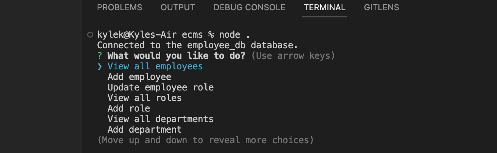
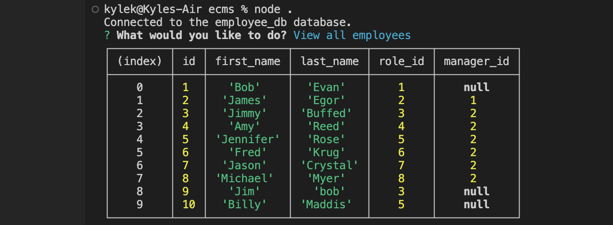
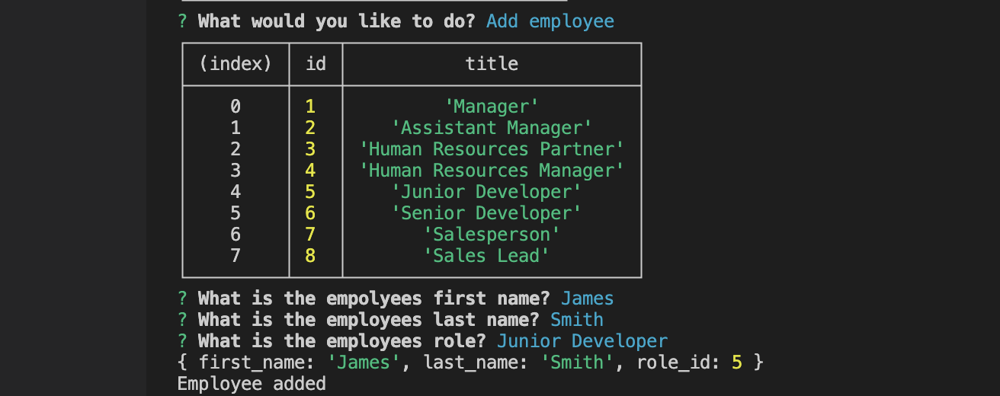

# ECMS

# About
An employee content management system that is used to access a database with all their departments, employees, roles as well as salaries.

# Installation
To use this application the user must install the following:

Package.json - `npm init` in the command line.

Inquirer - `npm inquirer@8.2.4` in the command line.

MySQL2 - `npm i mysql2@2.2.5` in the command line.

Express- `npm i express4.17.1` in the command line.

# Description
This application is for anyone wanting to use a database to manage the details of their staff. They can add and update details of their employees and their departments.

# Mock-up
The following images show the applications functionality and appearance.

# Links

## Github Repo
https://github.com/KyleKarotko/ecms

## Video of running application
https://drive.google.com/file/d/1iw9ay5JvvgZFF7qIQLADkZZ5aO2m1-iL/view